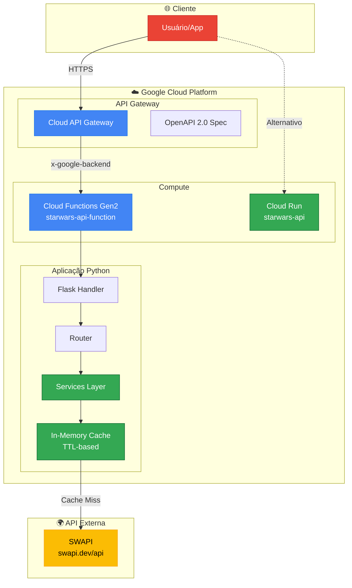
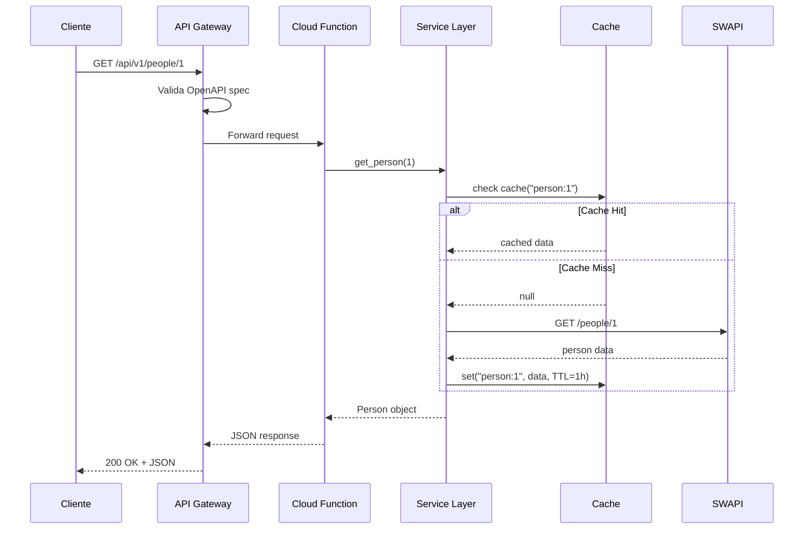

# 🏗️ Arquitetura - Star Wars API Platform

> **Versão:** 2.0 | **Data:** 01/02/2026 | **Status:** Produção  
> **Challenge:** PowerOfData - Case Técnico

---

## 📋 Visão Geral

A **Star Wars API Platform** é uma API RESTful que serve como proxy inteligente para a SWAPI (Star Wars API), adicionando autenticação, cache, rate limiting, e endpoints exclusivos como rankings e timeline.

### 🌐 URLs de Produção

| Ambiente | URL | Descrição |
|----------|-----|-----------|
| **API Gateway** | https://starwars-gateway-d9x6gbjl.uc.gateway.dev | ⭐ Endpoint principal |
| **Cloud Function** | https://us-central1-starwars-api-2026.cloudfunctions.net/starwars-api-function | Backend direto |
| **Cloud Run** | https://starwars-api-1040331397233.us-central1.run.app | Deploy alternativo |

---

## 🔧 Arquitetura de Componentes



---

## 📡 Endpoints Disponíveis

### Core Endpoints

| Método | Endpoint | Descrição |
|--------|----------|-----------|
| `GET` | `/` | Health check e status da API |
| `GET` | `/health` | Health check detalhado |

### People (Personagens)

| Método | Endpoint | Descrição |
|--------|----------|-----------|
| `GET` | `/api/v1/people` | Lista paginada de personagens |
| `GET` | `/api/v1/people/{id}` | Detalhes de um personagem |
| `GET` | `/api/v1/people/search?name={name}` | Busca por nome |

### Films (Filmes)

| Método | Endpoint | Descrição |
|--------|----------|-----------|
| `GET` | `/api/v1/films` | Lista todos os filmes |
| `GET` | `/api/v1/films/{id}` | Detalhes de um filme |

### Planets (Planetas)

| Método | Endpoint | Descrição |
|--------|----------|-----------|
| `GET` | `/api/v1/planets` | Lista paginada de planetas |
| `GET` | `/api/v1/planets/{id}` | Detalhes de um planeta |

### Starships (Naves)

| Método | Endpoint | Descrição |
|--------|----------|-----------|
| `GET` | `/api/v1/starships` | Lista paginada de naves |
| `GET` | `/api/v1/starships/{id}` | Detalhes de uma nave |

### 🆕 Endpoints Exclusivos

| Método | Endpoint | Descrição |
|--------|----------|-----------|
| `GET` | `/api/v1/rankings/most-appeared` | Top 10 personagens por aparições |
| `GET` | `/api/v1/rankings/tallest` | Top 10 personagens mais altos |
| `GET` | `/api/v1/rankings/heaviest` | Top 10 personagens mais pesados |
| `GET` | `/api/v1/timeline` | Linha do tempo dos filmes |

---

## 🔄 Fluxo de Requisição



---

## 📁 Estrutura do Projeto

```
starwars-api/
├── 📁 cloud_functions/          # ⭐ Deploy para Cloud Functions
│   ├── main.py                  # Entry point Flask
│   ├── requirements.txt         # Dependências
│   ├── api_gateway_config.yaml  # OpenAPI 2.0 spec
│   └── 📁 src/                  # Código da aplicação
│       ├── 📁 services/         # Lógica de negócio
│       ├── 📁 models/           # Modelos Pydantic
│       └── 📁 utils/            # Cache, HTTP client
│
├── 📁 src/                      # Código FastAPI (Cloud Run)
│   ├── main.py                  # FastAPI entry point
│   ├── config.py                # Configurações
│   ├── dependencies.py          # DI container
│   ├── 📁 api/                  # Routers FastAPI
│   ├── 📁 services/             # Lógica de negócio
│   ├── 📁 models/               # Modelos Pydantic
│   └── 📁 utils/                # Utilitários
│
├── 📁 tests/                    # Testes (48 tests)
│   ├── 📁 unit/                 # Testes unitários
│   └── conftest.py              # Fixtures pytest
│
├── 📁 docs/                     # Documentação
│   ├── architecture.md          # Este arquivo
│   ├── DEPLOY_GUIDE.md          # Guia de deploy
│   └── 📁 planning/             # Planejamento
│
├── Dockerfile                   # Container Cloud Run
├── pyproject.toml               # Config Python/Ruff
└── README.md                    # Documentação principal
```

---

## ⚙️ Stack Tecnológica

### Backend

| Tecnologia | Versão | Uso |
|------------|--------|-----|
| Python | 3.12 | Runtime |
| Flask | 3.x | Cloud Functions handler |
| FastAPI | 0.109+ | Cloud Run handler |
| Pydantic | 2.x | Validação de dados |
| HTTPX | 0.27+ | Cliente HTTP async |

### Google Cloud

| Serviço | Uso |
|---------|-----|
| Cloud Functions Gen2 | Compute serverless |
| API Gateway | Roteamento e OpenAPI |
| Cloud Run | Deploy alternativo |
| Artifact Registry | Container images |

### Desenvolvimento

| Ferramenta | Uso |
|------------|-----|
| Ruff | Linting e formatação |
| Pytest | Testes unitários |
| UV | Gerenciador de pacotes |

---

## 💾 Estratégia de Cache

O cache é implementado em memória com TTL (Time-To-Live):

| Recurso | TTL | Motivo |
|---------|-----|--------|
| Filmes | 24 horas | Dados estáticos |
| Planetas | 1 hora | Raramente mudam |
| Personagens | 1 hora | Raramente mudam |
| Naves | 1 hora | Raramente mudam |
| Listas | 5 minutos | Paginação ativa |
| Rankings | 30 minutos | Dados agregados |

---

## 🛡️ Segurança

### Rate Limiting

- **100 requests/minuto** por IP
- Implementado via middleware Flask
- Headers informativos: `X-RateLimit-Limit`, `X-RateLimit-Remaining`

### Headers de Segurança

```python
response.headers["X-Content-Type-Options"] = "nosniff"
response.headers["X-Frame-Options"] = "DENY"
response.headers["X-XSS-Protection"] = "1; mode=block"
```

---

## 📊 Monitoramento

### Cloud Monitoring

- Métricas automáticas de Cloud Functions
- Logs estruturados no Cloud Logging
- Alertas configuráveis

### Endpoints de Health

```bash
# Health check simples
curl https://starwars-gateway-d9x6gbjl.uc.gateway.dev/

# Health check detalhado
curl https://starwars-gateway-d9x6gbjl.uc.gateway.dev/health
```

---

## 💰 Custos (Free Tier)

| Serviço | Free Tier | Uso Estimado |
|---------|-----------|--------------|
| Cloud Functions | 2M invocações/mês | ~10k |
| API Gateway | 2M chamadas/mês | ~10k |
| Cloud Run | 2M requests/mês | ~1k |
| Networking | 1GB egress/mês | ~100MB |

**Custo estimado:** $0.00/mês (dentro do free tier)

---

## 🚀 Deploy Rápido

### Cloud Functions + API Gateway

```powershell
# 1. Deploy da função
cd cloud_functions
gcloud functions deploy starwars-api-function `
    --gen2 `
    --runtime=python312 `
    --trigger-http `
    --allow-unauthenticated `
    --entry-point=starwars_api `
    --memory=256MB `
    --timeout=60s `
    --region=us-central1

# 2. Criar API Gateway
gcloud api-gateway apis create starwars-api
gcloud api-gateway api-configs create starwars-config-v3 `
    --api=starwars-api `
    --openapi-spec=api_gateway_config.yaml

gcloud api-gateway gateways create starwars-gateway `
    --api=starwars-api `
    --api-config=starwars-config-v3 `
    --location=us-central1
```

---

## 📚 Referências

- [SWAPI Documentation](https://swapi.dev/documentation)
- [Cloud Functions Gen2](https://cloud.google.com/functions/docs/concepts/version-comparison)
- [API Gateway](https://cloud.google.com/api-gateway/docs)
- [FastAPI](https://fastapi.tiangolo.com/)

---

## 🖥️ Frontend

O frontend é uma SPA (Single Page Application) em HTML/JavaScript puro, servida via FastAPI StaticFiles:

### Características
- **Tailwind CSS + DaisyUI** - Estilização responsiva
- **Auto-detecção** - Detecta ambiente local vs produção
- **Prefixo API** - Adiciona `/api/v1` automaticamente para local
- **Imagens** - Usa Akabab API para personagens, TMDB para filmes

### Acesso Local
```bash
# Iniciar servidor
uvicorn src.main:app --reload --port 8000

# Acessar frontend
http://127.0.0.1:8000/frontend/index.html
```

---

> **Última atualização:** 03/02/2026 por Vinícius Lopes
