# Star Wars API - Technical Architecture

## Overview

This document provides a detailed technical architecture for the Star Wars API Platform, a REST API that consumes data from SWAPI (Star Wars API) and provides enhanced functionality including authentication, caching, filtering, sorting, and analytics.

## Architecture Diagram

```mermaid
flowchart TB
    subgraph Clients["🖥️ Clients"]
        WEB[Web Applications]
        MOB[Mobile Apps]
        CLI[CLI/Postman]
    end

    subgraph GCP["☁️ Google Cloud Platform"]
        subgraph Gateway["API Gateway Layer"]
            APIGW[Cloud API Gateway]
            subgraph Security["Security"]
                RATELIMIT[Rate Limiting]
                CORS[CORS Handling]
            end
        end
        
        subgraph Auth["🔒 Authentication"]
            FIREBASE[Firebase Auth]
            APIKEYS[API Keys]
        end
        
        subgraph Compute["⚡ Compute Layer"]
            CF[Cloud Functions]
            subgraph App["FastAPI Application"]
                ROUTER[API Router]
                MIDDLEWARE[Auth Middleware]
                SERVICES[Business Services]
                MODELS[Pydantic Models]
            end
        end
        
        subgraph Storage["💾 Data Layer"]
            CACHE[In-Memory Cache]
            FS[(Firestore)]
        end
        
        subgraph Observability["📊 Observability"]
            LOGGING[Cloud Logging]
            MONITORING[Cloud Monitoring]
            TRACE[Cloud Trace]
        end
    end

    subgraph External["🌐 External Services"]
        SWAPI[SWAPI.dev API]
    end

    Clients --> APIGW
    APIGW --> CF
    CF --> Auth
    CF --> SWAPI
    CF --> Storage
    CF --> Observability
```



## Component Details

### 1. API Gateway Layer

**Cloud API Gateway** serves as the entry point for all API requests:
- **Rate Limiting**: 100 requests/minute per client
- **CORS**: Configurable allowed origins
- **SSL Termination**: HTTPS only
- **Request Routing**: Routes to appropriate Cloud Function

### 2. Authentication Layer

Dual authentication support:

#### Firebase Auth (Primary)
- JWT token verification
- User management via Firebase Console
- Supports email/password, Google, and other OAuth providers

#### API Keys (Secondary)
- Simple API key validation
- Useful for service-to-service communication
- Keys stored in environment variables or Secret Manager

### 3. Compute Layer

**Cloud Functions** running FastAPI application:

```
src/
├── main.py              # FastAPI app entry point
├── config.py            # Environment configuration
├── dependencies.py      # Dependency injection
├── api/
│   ├── v1/
│   │   ├── people.py    # Characters endpoints
│   │   ├── films.py     # Films endpoints
│   │   ├── starships.py # Starships endpoints
│   │   ├── planets.py   # Planets endpoints
│   │   ├── vehicles.py  # Vehicles endpoints
│   │   ├── species.py   # Species endpoints
│   │   ├── statistics.py# Analytics endpoints
│   │   └── comparison.py# Comparison endpoints
├── models/              # Pydantic schemas
├── services/            # Business logic
├── auth/                # Authentication
└── utils/               # Helpers
```

### 4. Data Layer

#### Caching Strategy

Two-tier caching for optimal performance:

1. **In-Memory Cache** (per function instance)
   - TTL: 5 minutes - 1 hour depending on data type
   - Persists across Cloud Function warm starts
   - Fast access for repeated requests

2. **Firestore Cache** (optional, for production)
   - Persistent across all function instances
   - Longer TTL for stable data (films: 24 hours)
   - Automatic cache invalidation

```python
# Cache TTL Strategy
TTL_SHORT = 300      # 5 min - Lists, search results
TTL_MEDIUM = 3600    # 1 hour - Individual resources
TTL_LONG = 86400     # 24 hours - Static data (films)
```

### 5. External Services

**SWAPI (swapi.dev)** - Source of Star Wars data:
- Rate limit: 10,000 requests/day
- Resources: People, Films, Starships, Planets, Vehicles, Species
- Search support on most resources

## API Endpoints

### Resource Endpoints

| Resource | Endpoint | Methods | Features |
|----------|----------|---------|----------|
| People | `/api/v1/people` | GET | Filter, Sort, Paginate, Search |
| Films | `/api/v1/films` | GET | Sort by episode/date |
| Starships | `/api/v1/starships` | GET | Filter, Sort, Search |
| Planets | `/api/v1/planets` | GET | Filter, Sort, Search |
| Vehicles | `/api/v1/vehicles` | GET | Filter, Sort |
| Species | `/api/v1/species` | GET | Filter, Sort |

### Correlated Endpoints

| Endpoint | Description |
|----------|-------------|
| `/api/v1/people/{id}/films` | Films a character appears in |
| `/api/v1/people/{id}/starships` | Starships piloted by character |
| `/api/v1/films/{id}/characters` | All characters in a film |
| `/api/v1/films/{id}/planets` | All planets in a film |
| `/api/v1/planets/{id}/residents` | Residents of a planet |
| `/api/v1/starships/{id}/pilots` | Pilots of a starship |

### Analytics Endpoints

| Endpoint | Description |
|----------|-------------|
| `/api/v1/statistics/overview` | Universe totals and records |
| `/api/v1/statistics/films` | Film statistics and averages |
| `/api/v1/statistics/characters` | Character demographics |
| `/api/v1/statistics/planets` | Planet statistics |

### Comparison Endpoints

| Endpoint | Description |
|----------|-------------|
| `/api/v1/compare/characters?ids=1&ids=2` | Compare characters |
| `/api/v1/compare/starships?ids=10&ids=12` | Compare starships |
| `/api/v1/compare/planets?ids=1&ids=5` | Compare planets |

## Request Flow


## Technology Stack

| Component | Technology | Version |
|-----------|------------|---------|
| Framework | FastAPI | 0.109+ |
| Validation | Pydantic | 2.5+ |
| HTTP Client | httpx | 0.26+ |
| Testing | pytest | 7.4+ |
| Auth | Firebase Admin | 6.3+ |
| Cloud | GCP Cloud Functions | Gen 2 |
| Gateway | Cloud API Gateway | - |

## Deployment Architecture

### Development
```bash
uvicorn src.main:app --reload --port 8000
```

### Production (Cloud Functions)
```python
# main.py exports for Cloud Functions
from src.main import app
import functions_framework

@functions_framework.http
def starwars_api(request):
    return app(request)
```

## Security Considerations

1. **Authentication**: All endpoints optionally protected by Firebase Auth
2. **Rate Limiting**: API Gateway enforces request limits
3. **Input Validation**: Pydantic validates all inputs
4. **CORS**: Configurable allowed origins
5. **HTTPS**: Enforced at API Gateway level
6. **Secrets**: Stored in environment variables or Secret Manager

## Scalability

- **Stateless Design**: Cloud Functions scale automatically
- **Caching**: Reduces load on SWAPI
- **Async Operations**: Non-blocking I/O with httpx
- **Concurrent Requests**: Parallel fetching for related resources

## Monitoring

- **Cloud Logging**: Structured logs for all requests
- **Cloud Monitoring**: Custom metrics and alerts
- **Cloud Trace**: Request tracing across services
- **Error Reporting**: Automatic error tracking
