# Star Wars API Platform - Implementation Plan

## 📖 Overview

Build a production-ready REST API that consumes the Star Wars API (SWAPI) and provides enhanced functionality including authentication, caching, filtering, sorting, and correlated queries. The solution will be deployed on Google Cloud Platform using Cloud Functions and API Gateway.

---

## 🏗️ Technical Architecture

```mermaid
flowchart TB
    subgraph Client["🖥️ Clients"]
        WEB[Web App]
        MOB[Mobile App]
        POST[Postman/cURL]
    end

    subgraph GCP["☁️ Google Cloud Platform"]
        subgraph APILayer["API Gateway Layer"]
            APIGW[API Gateway]
        end
        
        subgraph Auth["🔒 Authentication"]
            FIREBASE[Firebase Auth]
        end
        
        subgraph Compute["⚡ Compute"]
            CF[Cloud Functions<br/>FastAPI]
        end
        
        subgraph Storage["💾 Storage"]
            FS[Firestore<br/>Cache + User Data]
        end
        
        subgraph Monitoring["📊 Monitoring"]
            LOG[Cloud Logging]
            MON[Cloud Monitoring]
        end
    end

    subgraph External["🌐 External"]
        SWAPI[SWAPI.dev]
    end

    WEB --> APIGW
    MOB --> APIGW
    POST --> APIGW
    
    APIGW --> CF
    APIGW -.-> FIREBASE
    
    CF --> FS
    CF --> SWAPI
    CF --> LOG
    CF --> MON
    
    FIREBASE -.-> CF
```



---

## User Review Required

> [!IMPORTANT]
> **GCP Account Setup Required**
> You'll need to create a GCP account with billing enabled before deployment. The free tier covers most of our needs:
> - Cloud Functions: 2 million invocations/month free
> - Firestore: 1GB storage + 50K reads/20K writes per day free
> - Firebase Auth: Unlimited free for email/password

> [!WARNING]
> **SWAPI Limitations**
> The SWAPI is read-only and has a rate limit of 10,000 requests/day. Our caching strategy will mitigate this, but be aware during development.

---

## Proposed Changes

### 📁 Project Structure

```
starwars-api/
├── .github/
│   └── workflows/
│       └── deploy.yml              # CI/CD pipeline
├── src/
│   ├── __init__.py
│   ├── main.py                     # FastAPI app entry point
│   ├── config.py                   # Configuration settings
│   ├── dependencies.py             # Dependency injection
│   │
│   ├── api/
│   │   ├── __init__.py
│   │   ├── v1/
│   │   │   ├── __init__.py
│   │   │   ├── router.py           # API v1 router
│   │   │   ├── people.py           # People endpoints
│   │   │   ├── films.py            # Films endpoints
│   │   │   ├── starships.py        # Starships endpoints
│   │   │   ├── planets.py          # Planets endpoints
│   │   │   ├── vehicles.py         # Vehicles endpoints
│   │   │   ├── species.py          # Species endpoints
│   │   │   ├── statistics.py       # Analytics endpoints
│   │   │   └── comparison.py       # Comparison endpoints
│   │   └── health.py               # Health check endpoint
│   │
│   ├── models/
│   │   ├── __init__.py
│   │   ├── base.py                 # Base response models
│   │   ├── people.py               # People schemas
│   │   ├── films.py                # Films schemas
│   │   ├── starships.py            # Starships schemas
│   │   ├── planets.py              # Planets schemas
│   │   ├── vehicles.py             # Vehicles schemas
│   │   ├── species.py              # Species schemas
│   │   └── statistics.py           # Statistics schemas
│   │
│   ├── services/
│   │   ├── __init__.py
│   │   ├── swapi_client.py         # SWAPI HTTP client
│   │   ├── cache_service.py        # Cache management
│   │   ├── people_service.py       # People business logic
│   │   ├── films_service.py        # Films business logic
│   │   ├── starships_service.py    # Starships business logic
│   │   ├── planets_service.py      # Planets business logic
│   │   └── statistics_service.py   # Statistics calculations
│   │
│   ├── auth/
│   │   ├── __init__.py
│   │   ├── firebase.py             # Firebase Admin SDK setup
│   │   ├── middleware.py           # Auth middleware
│   │   └── dependencies.py         # Auth dependencies
│   │
│   └── utils/
│       ├── __init__.py
│       ├── pagination.py           # Pagination helpers
│       ├── filtering.py            # Filter helpers
│       └── sorting.py              # Sorting helpers
│
├── tests/
│   ├── __init__.py
│   ├── conftest.py                 # Pytest fixtures
│   ├── unit/
│   │   ├── test_swapi_client.py
│   │   ├── test_people_service.py
│   │   ├── test_films_service.py
│   │   └── test_filtering.py
│   ├── integration/
│   │   ├── test_people_api.py
│   │   ├── test_films_api.py
│   │   └── test_auth.py
│   └── e2e/
│       └── test_scenarios.py
│
├── docs/
│   ├── architecture.md             # Technical architecture
│   ├── api.md                      # API documentation
│   └── setup.md                    # Setup guide
│
├── .env.example                    # Environment variables template
├── .gitignore
├── requirements.txt                # Production dependencies
├── requirements-dev.txt            # Development dependencies
├── pyproject.toml                  # Project configuration
├── Makefile                        # Development commands
└── README.md                       # Project documentation
```

---

### Component 1: Core Application

#### [NEW] [main.py](file:///C:/Users/vinic/.gemini/antigravity/scratch/starwars-api/src/main.py)

FastAPI application with CORS, exception handling, and automatic OpenAPI docs.

```python
# Key features:
- FastAPI app with metadata for Swagger docs
- CORS middleware for cross-origin requests
- Global exception handling
- Health check endpoint
- API versioning (v1)
```

#### [NEW] [config.py](file:///C:/Users/vinic/.gemini/antigravity/scratch/starwars-api/src/config.py)

Pydantic Settings for configuration management:

```python
# Settings include:
- SWAPI_BASE_URL: str = "https://swapi.dev/api"
- CACHE_TTL_SECONDS: int = 3600 (1 hour)
- FIREBASE_PROJECT_ID: str
- GCP_PROJECT_ID: str
- ENVIRONMENT: str = "development"
```

---

### Component 2: API Endpoints

#### [NEW] [people.py](file:///C:/Users/vinic/.gemini/antigravity/scratch/starwars-api/src/api/v1/people.py)

| Endpoint | Method | Description |
|----------|--------|-------------|
| `/api/v1/people` | GET | List all characters with pagination, filtering, sorting |
| `/api/v1/people/{id}` | GET | Get character by ID with expanded relations |
| `/api/v1/people/{id}/films` | GET | Get all films for a character |
| `/api/v1/people/{id}/starships` | GET | Get all starships piloted by character |
| `/api/v1/people/search` | GET | Search characters by name |

**Query Parameters:**
- `page` (int): Page number (default: 1)
- `page_size` (int): Items per page (default: 10, max: 100)
- `sort_by` (str): Field to sort by (name, height, mass, birth_year)
- `sort_order` (str): "asc" or "desc"
- `gender` (str): Filter by gender
- `homeworld` (str): Filter by homeworld name
- `expand` (bool): Include related resources in response

#### [NEW] [films.py](file:///C:/Users/vinic/.gemini/antigravity/scratch/starwars-api/src/api/v1/films.py)

| Endpoint | Method | Description |
|----------|--------|-------------|
| `/api/v1/films` | GET | List all films with sorting by release date |
| `/api/v1/films/{id}` | GET | Get film by ID with all related data |
| `/api/v1/films/{id}/characters` | GET | Get all characters in a film |
| `/api/v1/films/{id}/planets` | GET | Get all planets in a film |
| `/api/v1/films/{id}/starships` | GET | Get all starships in a film |

#### [NEW] [starships.py](file:///C:/Users/vinic/.gemini/antigravity/scratch/starwars-api/src/api/v1/starships.py)

| Endpoint | Method | Description |
|----------|--------|-------------|
| `/api/v1/starships` | GET | List all starships with filters |
| `/api/v1/starships/{id}` | GET | Get starship details |
| `/api/v1/starships/{id}/pilots` | GET | Get all pilots of a starship |
| `/api/v1/starships/compare` | GET | Compare multiple starships |

**Query Parameters for filtering:**
- `manufacturer` (str): Filter by manufacturer
- `starship_class` (str): Filter by class
- `min_cost` (int): Minimum cost in credits
- `max_cost` (int): Maximum cost in credits
- `min_length` (int): Minimum length in meters
- `max_length` (int): Maximum length in meters

#### [NEW] [planets.py](file:///C:/Users/vinic/.gemini/antigravity/scratch/starwars-api/src/api/v1/planets.py)

| Endpoint | Method | Description |
|----------|--------|-------------|
| `/api/v1/planets` | GET | List all planets with filters |
| `/api/v1/planets/{id}` | GET | Get planet details |
| `/api/v1/planets/{id}/residents` | GET | Get all residents of a planet |
| `/api/v1/planets/{id}/films` | GET | Get all films featuring a planet |

**Query Parameters:**
- `climate` (str): Filter by climate
- `terrain` (str): Filter by terrain
- `min_population` (int): Minimum population
- `max_population` (int): Maximum population

#### [NEW] [statistics.py](file:///C:/Users/vinic/.gemini/antigravity/scratch/starwars-api/src/api/v1/statistics.py)

| Endpoint | Method | Description |
|----------|--------|-------------|
| `/api/v1/statistics/overview` | GET | General statistics about the Star Wars universe |
| `/api/v1/statistics/films` | GET | Film-related statistics |
| `/api/v1/statistics/characters` | GET | Character demographics |
| `/api/v1/statistics/planets` | GET | Planet statistics |

**Response example for `/api/v1/statistics/overview`:**
```json
{
  "total_characters": 82,
  "total_planets": 60,
  "total_starships": 36,
  "total_films": 6,
  "most_populated_planet": "Coruscant",
  "largest_starship": "Death Star",
  "most_appearing_character": "Luke Skywalker"
}
```

#### [NEW] [comparison.py](file:///C:/Users/vinic/.gemini/antigravity/scratch/starwars-api/src/api/v1/comparison.py)

| Endpoint | Method | Description |
|----------|--------|-------------|
| `/api/v1/compare/characters` | GET | Compare 2+ characters |
| `/api/v1/compare/starships` | GET | Compare 2+ starships |
| `/api/v1/compare/planets` | GET | Compare 2+ planets |

**Query Parameters:**
- `ids` (list[int]): List of IDs to compare (e.g., `?ids=1&ids=2&ids=3`)

---

### Component 3: Pydantic Models

#### [NEW] [models/people.py](file:///C:/Users/vinic/.gemini/antigravity/scratch/starwars-api/src/models/people.py)

```python
class Person(BaseModel):
    id: int
    name: str
    height: Optional[int]  # cm
    mass: Optional[float]  # kg
    hair_color: str
    skin_color: str
    eye_color: str
    birth_year: str
    gender: str
    homeworld: Optional[Planet]  # Expanded when requested
    films: list[Film | int]      # Can be IDs or expanded objects
    species: list[Species | int]
    vehicles: list[Vehicle | int]
    starships: list[Starship | int]
    
class PersonFilter(BaseModel):
    gender: Optional[str] = None
    eye_color: Optional[str] = None
    homeworld_name: Optional[str] = None
    min_height: Optional[int] = None
    max_height: Optional[int] = None
```

Similar models for Films, Starships, Planets, Vehicles, and Species.

---

### Component 4: SWAPI Client Service

#### [NEW] [swapi_client.py](file:///C:/Users/vinic/.gemini/antigravity/scratch/starwars-api/src/services/swapi_client.py)

Async HTTP client with caching:

```python
class SWAPIClient:
    """Async client for SWAPI with integrated caching."""
    
    async def get_people(self, page: int = 1) -> list[dict]
    async def get_person(self, id: int) -> dict
    async def get_all_people(self) -> list[dict]  # Paginated fetch all
    async def search_people(self, query: str) -> list[dict]
    
    # Similar methods for films, starships, planets, vehicles, species
    
    async def _fetch_with_cache(self, url: str) -> dict:
        """Fetch from cache or SWAPI, with automatic caching."""
```

---

### Component 5: Authentication

#### [NEW] [auth/firebase.py](file:///C:/Users/vinic/.gemini/antigravity/scratch/starwars-api/src/auth/firebase.py)

```python
# Firebase Admin SDK initialization
# JWT token verification
# User context extraction
```

#### [NEW] [auth/middleware.py](file:///C:/Users/vinic/.gemini/antigravity/scratch/starwars-api/src/auth/middleware.py)

```python
class AuthMiddleware:
    """
    Validates Firebase JWT tokens.
    Supports both:
    - Bearer tokens (Firebase Auth)
    - API Keys (for service-to-service)
    """
```

**Authentication Flow:**


---

### Component 6: Caching Strategy

#### [NEW] [cache_service.py](file:///C:/Users/vinic/.gemini/antigravity/scratch/starwars-api/src/services/cache_service.py)

Two-tier caching strategy:

1. **In-memory cache** (for Cloud Functions warm starts)
2. **Firestore cache** (persistent across function instances)

```python
class CacheService:
    """Two-tier caching with in-memory and Firestore."""
    
    TTL_SHORT = 300      # 5 minutes for lists
    TTL_MEDIUM = 3600    # 1 hour for individual items
    TTL_LONG = 86400     # 24 hours for static data (films)
    
    async def get(self, key: str) -> Optional[dict]
    async def set(self, key: str, value: dict, ttl: int = TTL_MEDIUM)
    async def invalidate(self, pattern: str)
```

---

## Verification Plan

### Automated Tests

#### Unit Tests (pytest)

Run with:
```bash
# From project root
cd C:\Users\vinic\.gemini\antigravity\scratch\starwars-api
pytest tests/unit -v --cov=src --cov-report=html
```

Tests to implement:
1. `test_swapi_client.py` - Mock HTTP responses, test parsing
2. `test_people_service.py` - Test filtering, sorting, pagination logic
3. `test_films_service.py` - Test correlated queries
4. `test_filtering.py` - Test filter parameter parsing
5. `test_sorting.py` - Test sorting logic
6. `test_auth.py` - Test JWT validation with mocked Firebase

#### Integration Tests (pytest + httpx)

Run with:
```bash
pytest tests/integration -v
```

Tests to implement:
1. `test_people_api.py` - Test all people endpoints with TestClient
2. `test_films_api.py` - Test all films endpoints
3. `test_auth_integration.py` - Test protected routes

### Manual Verification

#### Local Development Testing

1. **Start the development server:**
   ```bash
   cd C:\Users\vinic\.gemini\antigravity\scratch\starwars-api
   uvicorn src.main:app --reload --port 8000
   ```

2. **Open Swagger UI:** Navigate to `http://localhost:8000/docs`

3. **Test endpoints manually:**
   - GET `/api/v1/people` - Should return paginated list
   - GET `/api/v1/people?gender=male&sort_by=name` - Should return filtered and sorted
   - GET `/api/v1/films/1/characters` - Should return all characters from Episode IV
   - GET `/api/v1/statistics/overview` - Should return aggregated stats

#### User Manual Testing Steps

> [!TIP]
> After deployment, I'll provide a Postman collection that you can use to test all endpoints.

1. Open the Swagger UI at `http://localhost:8000/docs`
2. Try the "Try it out" button on any endpoint
3. Verify responses match expected schemas
4. Test filtering by adding query parameters
5. Test sorting (ascending/descending)
6. Test pagination with different page sizes

---

## Implementation Timeline

| Day | Focus | Deliverables |
|-----|-------|--------------|
| **Day 1** (Today) | Setup & Core | Project setup, SWAPI client, basic endpoints |
| **Day 2** | Endpoints | All CRUD endpoints, filtering, sorting |
| **Day 3** | Advanced | Correlated queries, statistics, comparison |
| **Day 4** | Auth & Cache | Firebase Auth, caching layer |
| **Day 5** | Testing | Unit tests, integration tests, >80% coverage |
| **Day 6** | Deployment | GCP setup, Cloud Functions, API Gateway |
| **Day 7** | Documentation | README, architecture doc, presentation prep |

---

## Technologies Used

| Category | Technology | Justification |
|----------|------------|---------------|
| **Framework** | FastAPI | Modern, fast, automatic OpenAPI docs, async support |
| **Validation** | Pydantic v2 | Type-safe, fast, great for API schemas |
| **HTTP Client** | httpx | Async support, modern Python HTTP library |
| **Testing** | pytest + pytest-asyncio | Industry standard, async support |
| **Auth** | Firebase Auth | GCP native, easy setup, free tier |
| **Cache** | Firestore | GCP native, serverless, free tier |
| **Deployment** | Cloud Functions | Serverless, auto-scaling, GCP native |
| **API Gateway** | Cloud API Gateway | Request routing, rate limiting, API keys |

---

## Next Steps After Approval

1. Create project directory structure
2. Setup virtual environment and dependencies
3. Implement SWAPI client with async HTTP
4. Create Pydantic models for all resources
5. Implement base endpoints
